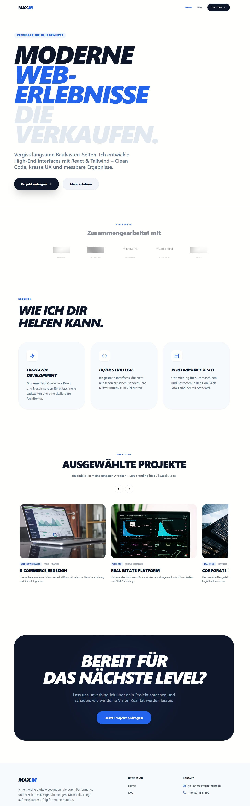

# Portfolio-Modern-Blau-Wei--Statisch-Githubpages-Cloudflarepages

Ein modernes, hochperformantes Portfolio-Template für Entwickler und Designer. Entwickelt für maximale Geschwindigkeit und einfache Anpassbarkeit.

## 🔗 Live Demo
Schau dir das fertige Ergebnis hier an:  
**[👉 Demo ansehen](https://portfolio-modern-blau-wei--statisch-githubpages-cloudflare.pages.dev/)**

<a href="https://portfolio-modern-blau-wei--statisch-githubpages-cloudflare.pages.dev/" target="_blank">
  
</a>

## 🚀 Features
- **Zentrale Konfiguration**: Alle Texte und Daten in einer einzigen Datei (`src/constants/content.js`).
- **Modern Tech-Stack**: React 18, Vite 6, Tailwind CSS und Framer Motion.
- **Vollständig Responsiv**: Optimiert für Mobile, Tablet und Desktop.
- **Rechtssicher**: Inklusive Impressum, Datenschutz und FAQ-Seite.
- **Deployment Ready**: Optimiert für GitHub Pages und Cloudflare Pages durch `HashRouter`.

## 🛠 Installation & Eigener Host

Du kannst dieses Template ganz einfach für dein eigenes Portfolio nutzen.

### 1. Projekt vorbereiten
- **Clonen**: Nutze `git clone [URL]`, um das Repository auf deinen Rechner zu kopieren.
- **Download**: Alternativ kannst du das Projekt als ZIP-Datei herunterladen und entpacken.

### 2. Lokal einrichten
```bash
# In den Projektordner wechseln
cd Portfolio-Modern-Blau-Wei--Statisch-Githubpages-Cloudflarepages

# Abhängigkeiten installieren
npm install

# Entwicklungsserver starten
npm run dev
```

### 3. Eigenes Repo erstellen & Deployen
1. Erstelle ein neues, leeres Repository auf deinem eigenen GitHub-Account.
2. Push den Code in dein neues Repository.
3. **GitHub Pages**: Gehe in die Einstellungen deines Repos -> Pages -> Wähle "GitHub Actions" als Quelle oder nutze den `gh-pages` Branch nach einem Build.
4. **Cloudflare Pages**: Verbinde dein GitHub-Konto mit Cloudflare, wähle das Repository aus und nutze folgende Build-Einstellungen:
   - **Framework Preset**: Vite
   - **Build command**: `npm run build`
   - **Build output directory**: `dist`
  

### oder auf Webspace hochladen
1. Downloade Dateien
2. Uploaden auf eigenen Webspace

## 📝 Anpassung
Um das Portfolio zu personalisieren, musst du nur die Datei **`src/constants/content.js`** bearbeiten. Dort findest du alle Namen, Texte, Projekte und FAQ-Einträge. Eine detaillierte Anleitung findest du in der `HILFE.md`.

## 📄 Lizenz
Dieses Projekt wurde von **ecomcodeLab** erstellt. Es steht unter der MIT-Lizenz.